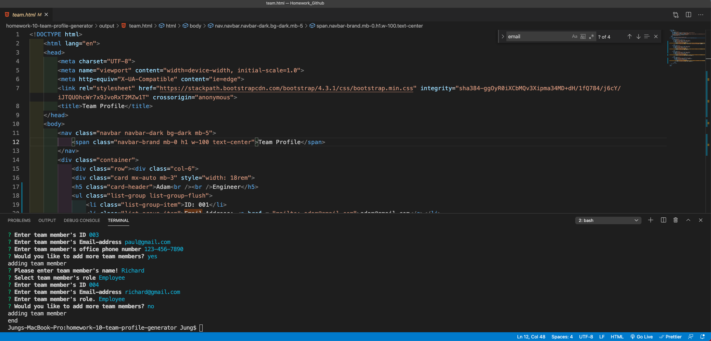
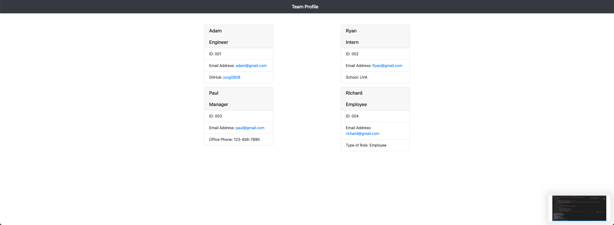

# Homework-10: Team Profile Generator.

# Description

This was my homework #10 Team Profile Generator. In this homework, the objective was to build a Node.js command-line application that takes in informationa bout employees on a software engineering team, then generate an HTML webpage that displays summaries for each person. Also, I needed to create a unit test for every role.

This homework was built upon last week's homework #9 Readme Generator. I first started out by creating the file structures in the readme.md. After that I needed to install inquirer and jest package. Following that, I created the test cases and connecting test folder with lib folder. After making sure the test cases passed, I moved onto my index.js folder and wrote an html template which would give an output to the output folder called team.html with the input that was provided from the node.js command line.

# Installation

Please open Intergerated terminal and run "node index.js" and fill out questions in order in which it is asked.

# Usage

Please follow the directions from README file.

# Contributing

Please follow the directions from README file.

# Tests

Please follow the directions from README file.

# Questions

Need to contact [jung0808?](https://github.com/jung0808)  
[You can contact me here - Email](mailto:j.nam0808@gmail.com)

# Screenshot of Project

##   Attached is also a personal link to my homework assignment #9

## https://github.com/jung0808/homework-9-readme-generator/

## Video demo of deployed application: https://drive.google.com/file/d/1a6wZONdXB7RshQ_iK1v2RP3TrhwnXczz/view
